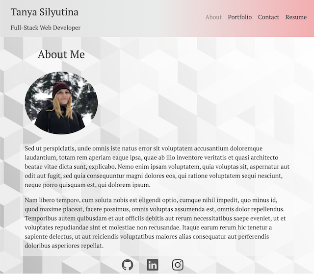
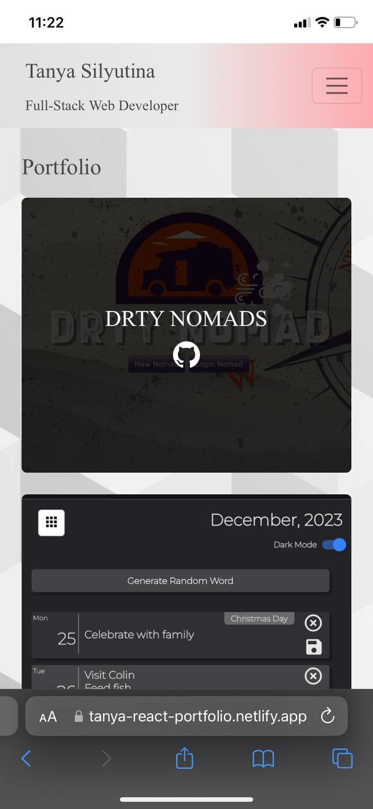

# React Portfolio

## Description

The React Portfolio is my website that stores my most recent projects, my bio, and my resume. The goal of the website is to showcase my developer skills and connect with other developers or potential employers.

## Deployment

Deployed through Netlify: [My Portfolio](https://tanya-react-portfolio.netlify.app/)

## Usage

The Website opens at the section 'About Me'.

* You can navigate to my GitHub, LinkedIn, or Instagram (the icons at the bottom)
* Portfolio section demonstrates my most recent projects
* Contact section lets users email me directly (back-end not set up, but all form validations work)
* Resume section contains my PDF resume and a list of my proficiencies

## License
N/A

## Features:

* Application scales perfectly to all screen sizes

